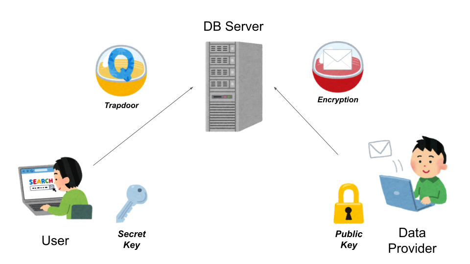
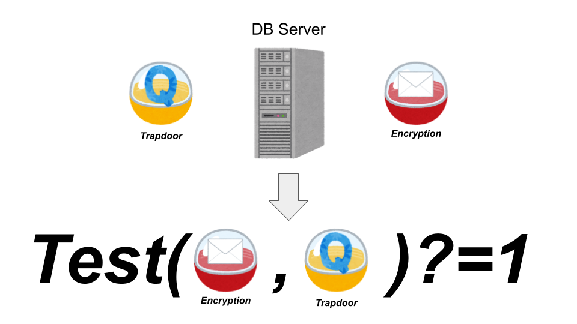

## Today's databases lack security.
Databases (DBs) play a significant role in today's Internet-based services. 
For example, online search services manage the data to be searched in a DB, which can be retrieved efficiently according to the user's query.
However, the more data stored in a DB, the more serious the damage of data leakage if that DB is attacked.
Notably, this is not a theoretical concern, but a real issue. In fact, it is estimated that popular Internet-based services, e.g., Yahoo, Facebook, and LinkedIn, have leaked over 100 million records [1]. 
From these cases, we believe that we need a solution that can protect the data confidentiality **even if data is leaked from the DB**.

## How public-key searchable encryption establishes both the convenience and security of databases.
A primitive solution to the above problem is to encrypt all data in the DB so that its contents cannot be known by an adversary who attacks the DB.
However, it would compromise the convenience of the DB because the server hosting the DB cannot search for the queried data.

We establish both the convenience and security by encrypting the data by **public-key searchable encryption (PKSE)**.
PKSE has the same features as standard public-key encryption schemes, e.g., RSA encryption scheme, except that **the secret key holder can allow a third party to test whether the encrypted data satisfies some search criteria, without revealing the data and the search criteria** [2].

In more detail, a user who wishes to search for data first generates a pair of secret and public keys. The public key is made available to a data provider who provides some data. The data provider encrypts the data with the user's public key and stores only the encryption on the DB server. The user then generates data corresponding to the user's search criteria, called **trapdoor**, and sends it to the DB server; the DB server can learn little information from the trapdoor. Since the DB server only receives the encryption and the trapdoor, it can protect the data confidentiality from an adversary who have access to all data in the DB, as well as from a malicious administrator of that server. 

Furthermore, the server can retrieve the encryption of the queried data using a test algorithm of the PKSE scheme. Formally, that algorithm **takes as input encrypted data and a trapdoor and outputs 1 if the data satisfies the search criteria for the provided trapdoor and 0 otherwise**. The server applies it to all candidate encryptions with the provided trapdoor and returns to the user only those encryptions for which it returns 1. In this way, the user can have the DB server search for apposite data as before.

## Sommelier DB: the world's first open source database based on public-key searchable encryption.
Following the approach described above, we propose a new PKSE-based DB library, Sommelier DB. While the PKSE-based DB has been considered in various studies [2-5], as far as our knowledge there are no open source implementations other than ours.

Sommelier DB is a fork of SQLite: it adds the following two functions:

1. A new SQL function for the test algorithm of the PKSE scheme.
2. C and Rust functions to generate a keyword encryption and a trapdoor of the PKSE scheme.

These functions allow you to enjoy the benefits of PKSE without understanding how it works!

## Reference
1. Todd, D. (2022, September). Top 10 Data Breaches of All Time, SecureWorld. https://www.secureworld.io/industry-news/top-10-data-breaches-of-all-time, (Accessed on 10/27/2022).
2. Boneh, D., Crescenzo, G. D., Ostrovsky, R., & Persiano, G. (2004, May). Public key encryption with keyword search. In International conference on the theory and applications of cryptographic techniques (pp. 506-522). Springer, Berlin, Heidelberg.
3. Matsuda, N., Hirano, T., Kawai, Y., Ito, T., Hattori, M., Yamanaka, T., & Nishigaki, M. (2020). Public-key Searchable Encryption with Index Generation for Shared Database. Journal of Information Processing, 28, 520-536.
4. Wang, Z., Chen, B., Xiang, T., Zhou, L., Yan, H., & Li, J. (2021, November). Public Key Based Searchable Encryption with Fine-Grained Sender Permission Control. In International Conference on Provable Security (pp. 3-18). Springer, Cham.
5. Prasanna, B. T., & Akki, C. B. (2015). A comparative study of homomorphic and searchable encryption schemes for cloud computing. arXiv preprint arXiv:1505.03263.